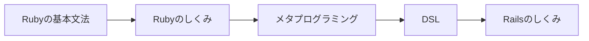
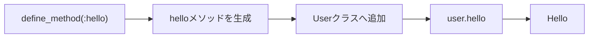
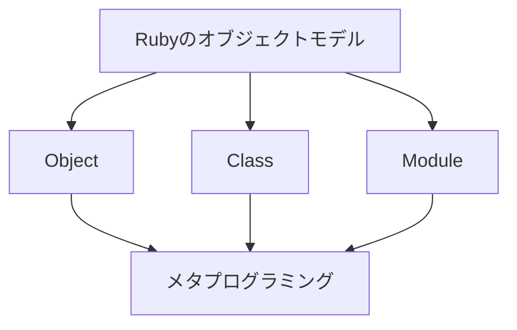
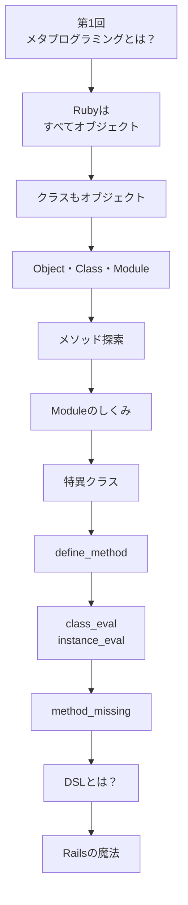

# 第1回 メタプログラミングとは？

## Railsの魔法の正体


## この動画について

📺 **[動画はこちら](https://youtu.be/0CoLsMNxN-8)**

Rubyには、なぜ has_many や validates、before_action のような、まるでRubyの文法のような書き方ができるのでしょうか？

その答えが メタプログラミング です。

この動画では、

メタプログラミングとは何か
Rubyが他の言語と何が違うのか
Railsの「魔法」の正体
このシリーズで学ぶ内容

について解説します。

このシリーズは、Rubyの基本文法を理解し、Railsを使った開発経験がある方を対象としています。

「書ける」から「理解できる」へ。

Rubyのオブジェクトモデルやメタプログラミングを学びながら、RubyやRailsの「見えない仕組み」を一緒に理解していきましょう。

📚 シリーズ
Rubyのしくみを理解しよう！
～メタプログラミングの世界から理解するRuby～

このシリーズでは、Object・Class・Moduleの関係から、メソッド探索、特異クラス（Eigenclass）、define_method、class_eval、instance_eval、method_missing、DSLまでを順番に学び、Railsの内部で何が起きているのかを理解していきます。

---

# オープニング

こんにちは、CodeBoost Laboです。

新シリーズ、

**「Rubyのしくみを理解しよう！」**

**～メタプログラミングの世界から理解するRuby～**

を始めます。

このシリーズは、

Rubyの文法を学ぶシリーズではありません。

Rubyの内部でどのような仕組みで動いているのか。

そして、

Railsの便利な機能がどのように実現されているのか。

その「見えない仕組み」を理解していくシリーズです。

今回は第1回。

まずは、

**メタプログラミングとは何か？**

というところから見ていきましょう。

---

# Railsの魔法

Railsでは、

このようなコードを書きます。

```ruby
class User < ApplicationRecord
  has_many :posts

  validates :name, presence: true
end
```

コントローラーでは、

```ruby
before_action :authenticate_user!
```

このようなコードも書きます。

初めて見ると、

「Rubyにはこんな文法があるのかな？」

と思うかもしれません。

しかし、

これらはRubyの文法ではありません。

Railsが用意したメソッドです。

では、

なぜこのような自然な書き方ができるのでしょうか。

その答えが、

**メタプログラミング**

です。

---

# このシリーズの全体像

まずは、シリーズ全体の位置付けを見てみましょう。



このシリーズでは、

Rubyの基本文法の次のステップとして、

Rubyの内部構造を理解していきます。

そして、

その知識を使って、

DSLやRailsの仕組みへとつなげていきます。

---

# メタプログラミングとは？

では、

メタプログラミングとは何でしょうか。

一言でいうと、

> **プログラムでプログラムを作り変える技術**

です。

普通のプログラムでは、

人がコードを書いて、

Rubyがそのコードを実行します。


一方、

メタプログラミングでは、

プログラム自身が、

メソッドやクラスを作ったり、

振る舞いを変更したりできます。

---

# サンプルプログラム

実際に見てみましょう。

**sample1.rb**

```ruby
class User
  define_method(:hello) do
    puts "Hello"
  end
end

user = User.new

user.hello
```

実行してみます。

```text
Hello
```

今回は、

`define_method`

というメソッドを使っています。

通常なら、

```ruby
def hello
  puts "Hello"
end
```

と書くところですが、

今回は

```ruby
define_method(:hello)
```

というコードで、

**helloというメソッドをプログラムが作っています。**

---

# このプログラムで起きていること

図で見てみましょう。



つまり、

Rubyでは、

**プログラム自身がプログラムの構造を作ることができる**

ということです。

これが、

メタプログラミングの基本的な考え方です。

なお、

今回は

`define_method`

の詳しい説明は行いません。

このシリーズの後半で、

改めて詳しく解説します。

---

# なぜRubyでこんなことができる？

では、

なぜRubyでは、

このようなことができるのでしょうか。

その答えは、

Rubyのオブジェクトモデルにあります。



Rubyでは、

クラスやメソッドも、

Ruby自身から操作できるように設計されています。

だから、

実行中にメソッドを追加したり、

クラスを書き換えたりできるのです。

その仕組みを、

これから順番に学んでいきます。

---

# 学習ロードマップ

このシリーズでは、

次の順番で理解を深めていきます。



前半では、

Rubyそのものの仕組みを理解します。

そして後半では、

その知識を使って、

DSLやRailsの仕組みへとつなげていきます。

---

# まとめ

今回は、

メタプログラミングとは何か、

そして、

このシリーズ全体のロードマップを紹介しました。

メタプログラミングとは、

**プログラムでプログラムを作り変える技術**

です。

そして、

その仕組みを理解するためには、

Rubyのオブジェクトモデルを理解する必要があります。

次回は、

**「Rubyはすべてオブジェクト」**

という、

Rubyでもっとも重要な考え方から学んでいきます。

それでは、

また次回お会いしましょう。

