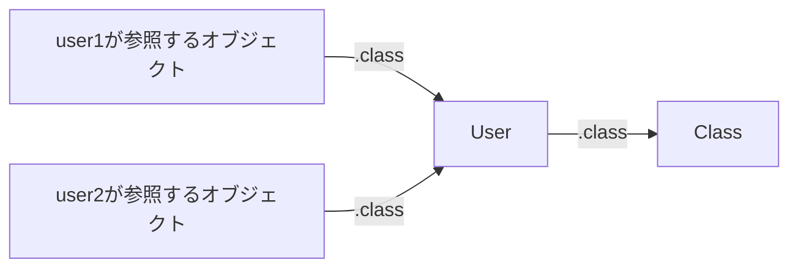
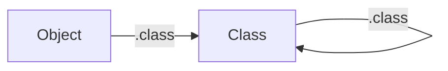

# 第3回 クラスもオブジェクト
## Class.classがClassになる理由

**Rubyのしくみを理解しよう！**  
**～メタプログラミングの世界から理解するRuby～**

前回の[第2回「Rubyはすべてオブジェクト」](../02_everything_is_object/README.md)では、値だけでなくクラス自身もオブジェクトであることを確認しました。今回は「インスタンスとは何か」と「クラスを生成する仕組み」から、`Class.class`が`Class`になる理由を掘り下げます。

第3回の動画リンクは公開後に掲載予定です。

## この回で学ぶこと

- インスタンスとは何か
- Userなどのクラス自身もClassのインスタンスであること
- Class.newで新しいクラスを作る方法
- Class.classがClassになる理由
- classとsuperclassが表す関係の違い

## ディレクトリ構成

```text
03_classes_are_objects/
├── README.md
├── sample1.rb   # インスタンスとクラス
├── sample2.rb   # Class.newによるクラスの生成
└── sample3.rb   # Class自身のクラスと継承元
```

## 実行方法

Rubyをインストールした環境で実行します。追加のgemは不要です。以下のコマンドは、このリポジトリのルート（`ruby_metaprogramming`）から実行してください。

```bash
cd 03_classes_are_objects
ruby sample1.rb
ruby sample2.rb
ruby sample3.rb
```

3本は独立したプログラムです。それぞれ別のRubyプロセスで実行してください。

動作確認環境：Ruby 3.4.9（macOS / arm64-darwin25）。以下の実行結果は、この環境で確認したものです。

## Sample1：インスタンスとクラス

ファイル：[`sample1.rb`](sample1.rb)

```ruby
class User
end

user1 = User.new
user2 = User.new

puts "user1.class: #{user1.class}"
puts "user2.class: #{user2.class}"
puts "同じオブジェクト？: #{user1.equal?(user2)}"
puts "User.class: #{User.class}"
puts "User.superclass: #{User.superclass}"
```

実行コマンド：

```bash
ruby sample1.rb
```

実行結果：

```text
user1.class: User
user2.class: User
同じオブジェクト？: false
User.class: Class
User.superclass: Object
```

### インスタンスは、あるクラスに属する個々のオブジェクト

`User.new`を2回実行すると、この例では別々のUserオブジェクトが作られます。`user1`と`user2`は、それぞれのオブジェクトを参照する変数です。このように、あるクラスに属する個々のオブジェクトを、そのクラスの**インスタンス**と呼びます。

`user1.class`と`user2.class`は、どちらも`User`を返します。一方、`equal?`は「同じオブジェクトか」を調べるため、この例の結果は`false`です。同じクラスのインスタンスでも、同じオブジェクトとは限りません。

### User自身もClassのインスタンス

`User.class`の結果は`Class`です。Userはインスタンスを作るクラスであると同時に、自身もClassのインスタンスです。



この図の矢印は、`.class`で調べた結果を表します。継承や生成順序を表す矢印ではありません。

`User.superclass`が`Object`になるのは、継承元を指定せずに定義したUserクラスがObjectを継承するためです。Classとのインスタンスの関係とは、分けて考えましょう。

### classとClassの表記

- `class User ... end`の`class`：クラスを定義するキーワード
- `user1.class`の`class`：オブジェクトのクラスを調べるメソッド
- `Class`：クラスを表すクラスを参照する定数

同じ「クラス」という読みでも、コード上の役割は異なります。

## Sample2：クラスを生成するクラス

ファイル：[`sample2.rb`](sample2.rb)

```ruby
Greeter = Class.new do
  def hello
    "こんにちは！"
  end
end

greeter = Greeter.new

puts "Greeter.class: #{Greeter.class}"
puts "Greeter.superclass: #{Greeter.superclass}"
puts "greeter.class: #{greeter.class}"
puts greeter.hello
```

実行コマンド：

```bash
ruby sample2.rb
```

実行結果：

```text
Greeter.class: Class
Greeter.superclass: Object
greeter.class: Greeter
こんにちは！
```

### Class.newでクラスを作る

`Class.new`は新しいクラスを生成して返します。この段階では名前のないクラスですが、`Greeter`という定数に代入することで、その名前で扱えます。Greeterは「あいさつをするもの」という意味です。

`do ... end`のブロックは、生成したクラスのコンテキストで実行されます。この例では、生成するクラスに`hello`というインスタンスメソッドを定義しています。`hello`は文字列を返し、最後の`puts greeter.hello`で表示します。

続く`Greeter.new`では、Greeterクラスのインスタンスを作っています。2つの`new`は、生成するものが異なります。

```text
Class.new   → 新しいクラスを生成 → Greeterに代入
Greeter.new → そのクラスのインスタンスを生成 → greeterに代入
```

`Greeter.class`は`Class`、`greeter.class`は`Greeter`になります。この動きから、Classを「クラスを生成するクラス」と捉えることができます。

また、`Class.new`に継承元を指定しなかった場合、生成したクラスはObjectを継承します。そのため、`Greeter.superclass`は`Object`です。

通常の`class`構文でも、新しくクラスを定義すると、クラスを表すオブジェクトが用意されます。ただし、`class`構文と`Class.new`は完全に同じ挙動ではありません。既存クラスの再オープンや定数の探索などに違いがあります。ここでは、新しいクラスを作る方法の1つとしてClass.newを確認しています。

## Sample3：Class.classがClassになる理由

ファイル：[`sample3.rb`](sample3.rb)

```ruby
puts "Object.class: #{Object.class}"
puts "Class.class: #{Class.class}"
puts "Class.class.class: #{Class.class.class}"
puts "ClassはClassのインスタンス？: #{Class.instance_of?(Class)}"
puts "Class.superclass: #{Class.superclass}"
```

実行コマンド：

```bash
ruby sample3.rb
```

実行結果：

```text
Object.class: Class
Class.class: Class
Class.class.class: Class
ClassはClassのインスタンス？: true
Class.superclass: Module
```

### Class自身もClassのインスタンス

Objectもクラスなので、`Object.class`は`Class`を返します。そしてClass自身も、RubyではClassのインスタンスとして扱われます。そのため、**`Class.class`の結果は`Class`になります。**

`instance_of?`は、指定したクラスのインスタンスかどうかを調べるメソッドです。`Class.instance_of?(Class)`の結果が`true`になることからも、この関係を確認できます。



`Class.class.class`としても、結果は`Class`です。`.class`はオブジェクトのクラスを返すメソッドであり、新しいクラスを生成するメソッドではありません。同じClassオブジェクトについて、再びクラスを調べています。

### 最初のClassは、どのように用意される？

Rubyを動かす処理系は、プログラムを実行するための準備として、ObjectやClassなどの基本クラスと、その関係を組み立てます。代表的な処理系であるCRubyでは、C言語でこの初期化を行います。

`Class.class`は、用意された関係を調べています。「Classが自分自身にnewを呼び出して自分を作った」という意味ではありません。

CRubyの初期化処理は、[公式ソース資料のclass.c](https://docs.ruby-lang.org/capi/en/master/d9/d0c/class_8c_source.html)にある`Init_class_hierarchy`で確認できます。ここでは基本クラスを用意し、Class自身のクラスをClassに設定しています。この資料は開発版のため、行番号や実装の詳細は変わることがあります。

## classとsuperclassを分けて考える

| 式 | 結果 | 調べていること |
| --- | --- | --- |
| `User.class` | `Class` | Userというオブジェクトが、どのクラスのインスタンスか |
| `User.superclass` | `Object` | Userが直接継承しているクラス |
| `Class.class` | `Class` | Classというオブジェクトが、どのクラスのインスタンスか |
| `Class.superclass` | `Module` | Classが直接継承しているクラス |

UserはClassのインスタンスであり、Objectを継承しています。同じように、ClassはClassのインスタンスですが、直接の継承元はModuleです。Classが自分自身を継承しているわけではありません。

**インスタンスの関係と継承の関係は別です。** 次回はObject・Class・Moduleの関係を、継承も含めて詳しく整理します。なお、ObjectにはBasicObjectという継承元があるため、Objectが継承階層の最上位というわけではありません。

## メタプログラミングへのつながり

Sample2では、プログラムの実行中にClass.newで新しいクラスを作りました。クラスを表すオブジェクトは、変数や定数で参照したり、メソッドに引数として渡したりできます。

このように、クラスそのものをプログラムで扱えることが、クラスやメソッドを操作するメタプログラミングの土台になります。

## まとめ

- インスタンスは、あるクラスに属する個々のオブジェクトです。
- Userなどのクラス自身も、Classのインスタンスです。
- Class.newで新しいクラスを作り、そのクラスのnewでインスタンスを作れます。
- Class自身もClassのインスタンスなので、Class.classはClassを返します。
- classはオブジェクトのクラス、superclassはクラスの直接の継承元を調べます。

## シリーズ案内

- 第1回：[メタプログラミングとは？](../01_metaprogramming/README.md) — [公開済み動画](https://youtu.be/0CoLsMNxN-8)
- 第2回：[Rubyはすべてオブジェクト](../02_everything_is_object/README.md) — [公開済み動画](https://youtu.be/Wb56Rch6T6U)
- 第3回：クラスもオブジェクト（今回）— 動画公開予定
- 第4回：Object・Class・Module — 予定
- [シリーズ全体の学習ロードマップ](../README.md)

## 参考資料

Ruby公式API資料（Ruby 3.4）とCRubyの公式ソース資料を参照しています。確認日：2026年9月29日。

- [Class](https://docs.ruby-lang.org/en/3.4/Class.html)：Classの役割、Class.new、superclass
- [Object#class](https://docs.ruby-lang.org/en/3.4/Object.html#method-i-class)：オブジェクトのクラスを取得
- [Object#equal?](https://docs.ruby-lang.org/en/3.4/Object.html#method-i-equal-3F)：同じオブジェクトかを確認
- [Object#instance_of?](https://docs.ruby-lang.org/en/3.4/Object.html#method-i-instance_of-3F)：指定したクラスのインスタンスかを確認
- [CRuby class.c（開発版）](https://docs.ruby-lang.org/capi/en/master/d9/d0c/class_8c_source.html)：基本クラスの初期化

## CodeBoost Labo

[YouTube：CodeBoost Labo](https://www.youtube.com/@CodeBoostLabo)

**知識は、点ではなく線でつながる。**
