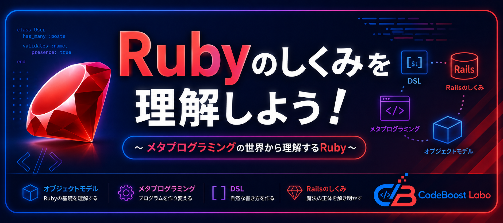
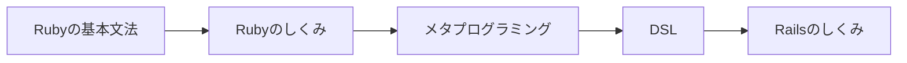
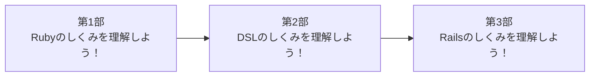
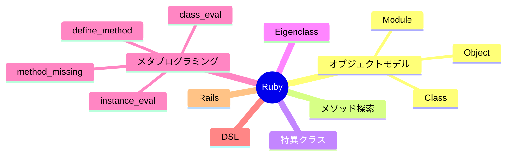
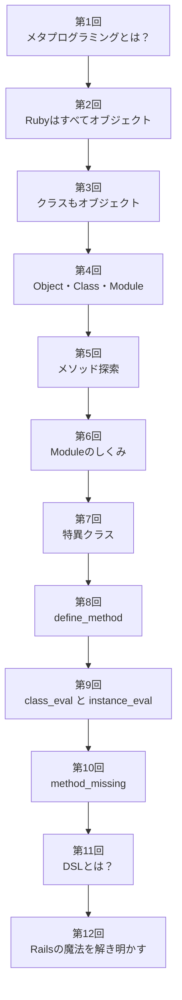
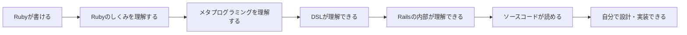

<p align="center">
  
</p>

# Rubyのしくみを理解しよう！
## ～メタプログラミングの世界から理解するRuby～

このリポジトリは、YouTubeチャンネル **CodeBoost Labo** の学習シリーズ

**「Rubyのしくみを理解しよう！ ～メタプログラミングの世界から理解するRuby～」**

で使用するサンプルコードや資料を公開しています。

このシリーズは、Rubyの文法を学ぶものではありません。

Rubyの内部で何が起きているのかを理解し、

Railsの「魔法」のような仕組みを読み解けるようになることを目的としています。

**書けるだけでは終わらない。**

**仕組みを理解すると、Rubyはもっと面白くなる。**

---

# このシリーズの位置付け



Rubyの基本文法を理解したら、

次は **「なぜ動くのか」** を理解する段階です。

このシリーズでは、

Rubyのオブジェクトモデルからメタプログラミングまでを学び、

その知識を土台として、

DSLやRailsの仕組みへと理解を広げていきます。

---

# 三部構成



## 第1部
### Rubyのしくみを理解しよう！

Rubyのオブジェクトモデルやメタプログラミングを理解します。

## 第2部
### DSLのしくみを理解しよう！

RubyでDSL（Domain Specific Language）を設計・実装する方法を学びます。

## 第3部
### Railsのしくみを理解しよう！

Railsで使われているDSLやメタプログラミングの仕組みを、ソースコードを読みながら理解します。

---

# このシリーズで学ぶこと



このシリーズでは、

- Rubyはすべてオブジェクト
- Object・Class・Moduleの関係
- メソッド探索
- 特異クラス（Eigenclass）
- define_method
- class_eval
- instance_eval
- method_missing
- DSLの考え方
- Railsの仕組み

を順番に学んでいきます。

---

# 学習ロードマップ



---

# このシリーズのゴール



このシリーズの目的は、

Rubyの文法を覚えることではありません。

Rubyの仕組みを理解し、

その知識を応用して、

RailsやGemのソースコードを読み、

自分で設計・実装できるようになることを目指します。

CodeBoost Laboでは、

**知識は、点ではなく線でつながる**

という考え方を大切にしています。

このシリーズで学ぶ知識は、

次のDSLシリーズ、

そしてRailsシリーズへとつながっていきます。

---

# 対象者

このシリーズは、次のような方を対象としています。

- Rubyの基本文法を理解している
- Railsを使ったことがある
- `has_many` や `validates` を使っている
- Rubyの内部構造を理解したい
- Railsのソースコードを読めるようになりたい

---

# ディレクトリ構成

```text
ruby_metaprogramming/
│
├── README.md
│
├── 01_metaprogramming/
├── 02_everything_is_object/
├── 03_classes_are_objects/
├── 04_object_class_module/
├── 05_method_lookup/
├── 06_module/
├── 07_eigenclass/
├── 08_define_method/
├── 09_class_instance_eval/
├── 10_method_missing/
├── 11_dsl_intro/
└── 12_rails_magic/
```

各ディレクトリには、次の内容を配置しています。

- README.md（動画の解説）
- サンプルコード
- 実行結果
- 動画で使用した図

---

# シリーズ一覧


| 状態 | # | タイトル | ディレクトリ |
|:---:|---:|---------|--------------|
| ⏳ | 1 | メタプログラミングとは？ | `01_metaprogramming` |
| ⏳ | 2 | Rubyはすべてオブジェクト | `02_everything_is_object` |
| ⏳ | 3 | クラスもオブジェクト | `03_classes_are_objects` |
| ⏳ | 4 | Object・Class・Module | `04_object_class_module` |
| ⏳ | 5 | メソッド探索 | `05_method_lookup` |
| ⏳ | 6 | Moduleのしくみ | `06_module` |
| ⏳ | 7 | 特異クラス（Eigenclass） | `07_eigenclass` |
| ⏳ | 8 | define_method | `08_define_method` |
| ⏳ | 9 | class_eval と instance_eval | `09_class_instance_eval` |
| ⏳ | 10 | method_missing | `10_method_missing` |
| ⏳ | 11 | DSLとは？ | `11_dsl_intro` |
| ⏳ | 12 | Railsの魔法を解き明かす | `12_rails_magic` |


**ステータス**

- ✅ 公開済み
- 🚧 制作中
- ⏳ 公開予定

※ タイトルや構成は変更になる場合があります。

---

# YouTube

CodeBoost Labo

YouTube再生リスト（準備中）

---

# ライセンス

MIT License

---

# CodeBoost Labo

CodeBoost Laboでは、

**「見えない仕組みを理解する」**

をコンセプトに、

プログラミングをより深く理解するためのコンテンツを発信しています。

プログラムは、動けば終わりではありません。

**なぜ動くのかを理解することで、応用できる力が身につきます。**

一緒に、Rubyのしくみを理解していきましょう。